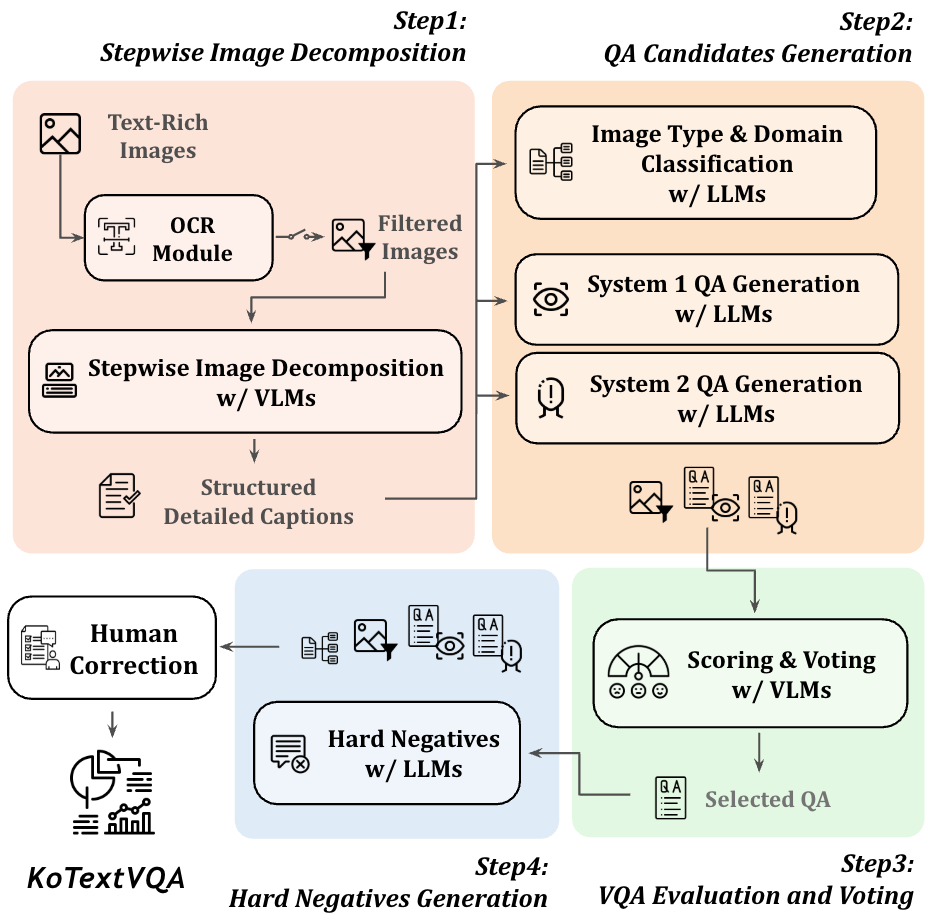
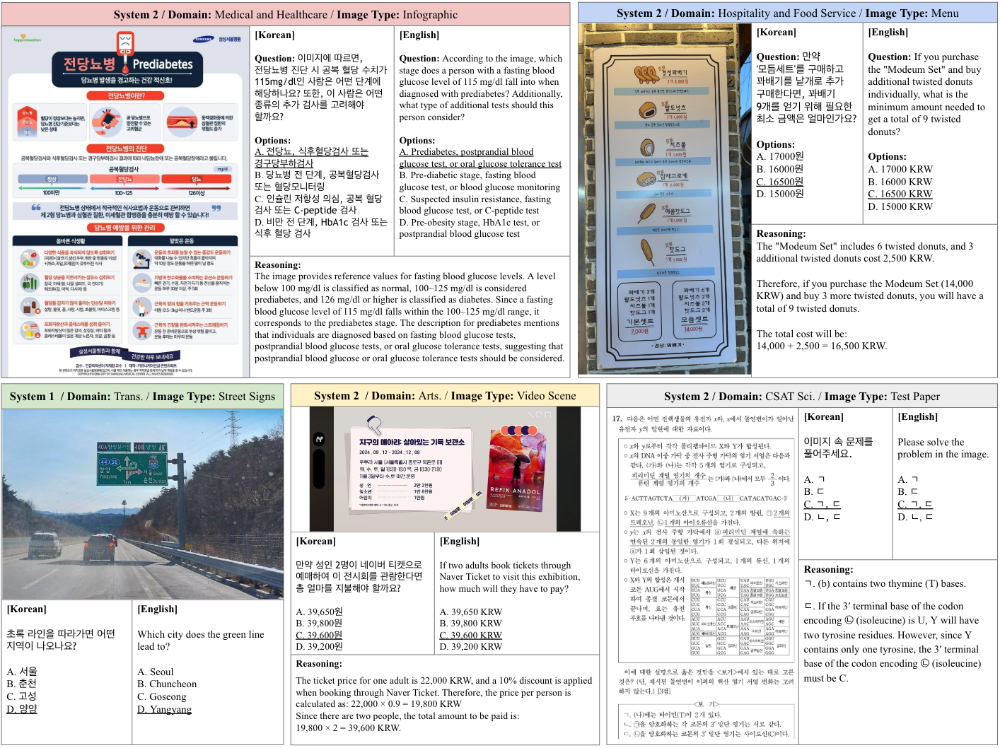

# KoTextVQA

| [📖 Paper](#) | [🤗 Dataset](https://huggingface.co/datasets/tabtoyou/KoTextVQA) | [🏆 Leaderboard](https://github.com/tabtoyou/KoTextVQA?tab=readme-ov-file#-leaderboard) |

KoTextVQA: A Benchmark for Understanding and Reasoning in Korean Text-Rich Visual Question Answering

## 🔥 News
* **`2025.TBA`** 🌟 KoTextVQA paper coming soon. [VLMEvalKit](https://github.com/open-compass/VLMEvalKit) support in preparation.
* **`2025.03.21`** 🌟 Evaluation code & Text-rich VQA dataset generation pipeline released! 🚀

## Introduction

<p align="center">
  
</p>

> In real-world scenarios, text within images plays a crucial role in conveying information across various domains, including documents, everyday scenes, and digital interfaces. Understanding text within its visual context remains a fundamental challenge for Vision-Language Models (VLMs), driving the development of text-rich Visual Question Answering (VQA) datasets and evaluation benchmarks. However, low-resource languages remain relatively unexplored, lacking appropriate benchmarks for real-world applications. In the absence of such benchmarks, systematic evaluation becomes challenging, hindering iterative improvements in model performance and the refinement of fine-tuning strategies. To address this, we introduce **KoTextVQA**, a **Ko**rean **Text**-Rich **VQA** benchmark for comprehensive VLM evaluation. KoTextVQA enables an in-depth evaluation of visual text understanding (System 1) and reasoning (System 2) capabilities, while also supporting a multifaceted assessment across diverse image types and domains. Additionally, we release an automated VQA generation pipeline that leverages widely-adopted foundation models to systematically construct benchmarks, enabling scalable and efficient creation of high-quality datasets. While our benchmark is designed specifically for Korean, the proposed methodology is highly adaptable and can be extended to other languages, supporting broader multilingual VLM research.


## Data
[🤗 KoTextVQA Dataset](https://huggingface.co/datasets/tabtoyou/KoTextVQA)
<p align="center">
  
</p>


## Settings
```bash
make setup # set environment (options: GPU)
make help  # print manual
```

## Text-Rich VQA Generation
```bash
make filter   # 1) filter out low-quality images with OCR Model
make generate # 2) automatically generate VQA using a 4-stage pipeline (options: INPUT_DIR)
make editor   # 3) refine VQA with streamlit-based editor (options: INPUT_DIR, OUTPUT_DIR, SAVE_BATCH)```
```

## Evaluation
`eval` folder contains inference and evaluate scripts for the KoTextVQA.

1. `infer_xxx.py`: For model inference
2. `evaluate.py`: For evaluating inference results

### 1. Model Inference

This script loads a specified model and performs inference. To run the script, use the following steps:

```bash
cd eval
python infer/infer_gpt.py [MODEL_NAME] [SETTING]
```

- **`[MODEL_NAME]`**: Specify the model's name (e.g., `gpt-4o-mini`, `gpt-4o-mini-2024-07-18`, etc.).
- **`[SETTING]`**: Specify the prompt setting (e.g., `default`, `direct`).

Example:

```bash
python infer/infer_gpt.py gpt-4o-mini default
```

### 2. Evaluation

This script evaluates the results generated from the inference step. To run the evaluation, use the following command:

```bash
cd eval
python evaluate.py
```

Once executed, the script will:
- Load the inference results from the `./output` directory.
- Generate and display the evaluation report in the console.
- Save the evaluation report to the `./output` directory.

## 🏆 LeaderBoard

<table style="width:90%;">
    <tr>
        <th>Models</th>
        <td><b>Open-Source</b></td>
        <td><b>Overall</b></td>
        <td><b>System1</b></td>
        <td><b>System2</b></td>
        <td><b>Gov.</b></td>
        <td><b>Econ.</b></td>
        <td><b>Mktg.</b></td>
        <td><b>Comm.</b></td>
        <td><b>Edu.</b></td>
        <td><b>Med.</b></td>
        <td><b>Tech.</b></td>
        <td><b>Arts.</b></td>
        <td><b>Transp.</b></td>
        <td><b>Tour.</b></td>
        <td><b>FnB.</b></td>
        <td><b>Ent.</b></td>
        <td><b>Life.</b></td>
        <td><b>Sci.</b></td>
        <td><b>Hist.</b></td>
    </tr>
    <!-- Closed Models -->
    <tr>
        <th align="left">Gemini-2.0-flash (25.02.05)</th>
        <td align="middle">✘</td>
        <td><b>85.4</b></td>
        <td><b>98.0</b></td>
        <td>69.8</td>
        <td><b>95.1</b></td>
        <td><b>95.2</b></td>
        <td><b>99.3</b></td>
        <td><b>96.1</b></td>
        <td><b>96.7</b></td>
        <td><b>92.2</b></td>
        <td>93.5</td>
        <td>98.8</td>
        <td><b>90.4</b></td>
        <td><b>98.1</b></td>
        <td>93.2</td>
        <td>95.2</td>
        <td><b>96.6</b></td>
        <td><b>44.1</b></td>
        <td>78.3</td>
    </tr>
    <tr>
        <th align="left">GPT-4o (24.11.20)</th>
        <td align="middle">✘</td>
        <td>84.6</td>
        <td>95.9</td>
        <td><b>70.5</b></td>
        <td>93.5</td>
        <td>92.3</td>
        <td>97.2</td>
        <td>90.3</td>
        <td><b>96.7</b></td>
        <td>91.1</td>
        <td><b>96.7</b></td>
        <td><b>100.0</b></td>
        <td>84.4</td>
        <td>93.5</td>
        <td><b>93.6</b></td>
        <td><b>97.0</b></td>
        <td>95.1</td>
        <td><b>44.1</b></td>
        <td><b>93.3</b></td>
    </tr>
    <tr style="border-bottom: 1.5px solid">
        <th align="left">Claude-3.5-Sonnet (24.10.22)</th>
        <td align="middle">✘</td>
        <td>80.5</td>
        <td>93.4</td>
        <td>64.5</td>
        <td>93.5</td>
        <td>91.3</td>
        <td>92.4</td>
        <td>87.0</td>
        <td>93.0</td>
        <td>91.1</td>
        <td>87.0</td>
        <td>91.6</td>
        <td>84.4</td>
        <td>94.4</td>
        <td>89.8</td>
        <td>92.3</td>
        <td>92.2</td>
        <td>37.4</td>
        <td>70.0</td>
    </tr>
    <tr>
        <th align="left">GPT-4o-mini (24.07.18)</th>
        <td align="middle">✘</td>
        <td>73.3</td>
        <td>88.7</td>
        <td>54.1</td>
        <td>82.4</td>
        <td>82.7</td>
        <td>85.5</td>
        <td>84.4</td>
        <td>87.4</td>
        <td>83.3</td>
        <td>80.4</td>
        <td>89.2</td>
        <td>80.2</td>
        <td>84.3</td>
        <td>81.4</td>
        <td>86.3</td>
        <td>87.3</td>
        <td>30.3</td>
        <td>45.0</td>
    </tr>
    <!-- Open-Source Models -->
    <tr>
        <th align="left">VARCO-VISION (14B)</th>
        <td align="middle">✅</td>
        <td><b>72.3</b></td>
        <td>90.9</td>
        <td><b>49.3</b></td>
        <td>81.6</td>
        <td><b>87.5</b></td>
        <td>83.4</td>
        <td><b>83.1</b></td>
        <td>84.2</td>
        <td><b>86.7</b></td>
        <td><b>84.8</b></td>
        <td>79.5</td>
        <td><b>82.6</b></td>
        <td>83.3</td>
        <td>76.1</td>
        <td>81.5</td>
        <td>85.3</td>
        <td>33.7</td>
        <td>31.7</td>
    </tr>
    <tr>
        <th align="left">Qwen2.5-VL (3B)</th>
        <td align="middle">✅</td>
        <td>71.8</td>
        <td>94.2</td>
        <td>43.9</td>
        <td>81.6</td>
        <td>76.9</td>
        <td>85.5</td>
        <td>77.9</td>
        <td><b>87.4</b></td>
        <td>80.0</td>
        <td>79.3</td>
        <td>85.5</td>
        <td>75.4</td>
        <td><b>84.3</b></td>
        <td>76.9</td>
        <td><b>87.5</b></td>
        <td>83.3</td>
        <td>33.9</td>
        <td>36.7</td>
    </tr>
    <tr>
        <th align="left">InternVL2.5 (8B)</th>
        <td align="middle">✅</td>
        <td>70.8</td>
        <td>89.8</td>
        <td>47.3</td>
        <td>81.6</td>
        <td>76.9</td>
        <td>85.5</td>
        <td>81.8</td>
        <td>83.7</td>
        <td>81.1</td>
        <td>77.2</td>
        <td>78.3</td>
        <td>76.0</td>
        <td>83.3</td>
        <td>74.2</td>
        <td>78.6</td>
        <td>85.8</td>
        <td><b>34.1</b></td>
        <td>38.3</td>
    </tr>
    <tr>
        <th align="left">InternVL2.5 (4B)</th>
        <td align="middle">✅</td>
        <td>70.7</td>
        <td>90.7</td>
        <td>45.9</td>
        <td><b>82.0</b></td>
        <td>76.9</td>
        <td><b>87.6</b></td>
        <td><b>83.1</b></td>
        <td>83.7</td>
        <td>78.9</td>
        <td>79.3</td>
        <td>79.5</td>
        <td>75.4</td>
        <td>77.8</td>
        <td>69.3</td>
        <td>81.0</td>
        <td><b>86.3</b></td>
        <td>33.9</td>
        <td><b>46.7</b></td>
    </tr>
    <tr>
        <th align="left">Qwen2.5-VL (7B)</th>
        <td align="middle">✅</td>
        <td>68.5</td>
        <td><b>94.5</b></td>
        <td>36.1</td>
        <td>80.0</td>
        <td>77.9</td>
        <td>85.5</td>
        <td>81.2</td>
        <td><b>87.4</b></td>
        <td>76.7</td>
        <td>75.0</td>
        <td><b>89.2</b></td>
        <td>77.8</td>
        <td>82.4</td>
        <td><b>77.7</b></td>
        <td>86.3</td>
        <td>85.8</td>
        <td>15.1</td>
        <td>36.7</td>
    </tr>
    <tr>
        <th align="left">MiniCPM-o-2.6 (8B)</th>
        <td align="middle">✅</td>
        <td>64.3</td>
        <td>84.1</td>
        <td>39.9</td>
        <td>75.9</td>
        <td>83.7</td>
        <td>79.3</td>
        <td>75.9</td>
        <td>76.7</td>
        <td>65.6</td>
        <td>75.0</td>
        <td>73.5</td>
        <td>69.5</td>
        <td>79.6</td>
        <td>67.8</td>
        <td>77.4</td>
        <td>74.0</td>
        <td>25.5</td>
        <td>25.0</td>
    </tr>
    <tr>
        <th align="left">Ovis1.6-Gemma2 (9B)</th>
        <td align="middle">✅</td>
        <td>58.4</td>
        <td>68.9</td>
        <td>45.4</td>
        <td>64.1</td>
        <td>69.2</td>
        <td>71.0</td>
        <td>72.7</td>
        <td>60.9</td>
        <td>71.1</td>
        <td>67.4</td>
        <td>53.0</td>
        <td>68.9</td>
        <td>75.9</td>
        <td>65.2</td>
        <td>58.9</td>
        <td>63.2</td>
        <td>30.5</td>
        <td>28.3</td>
    </tr>
    <tr>
        <th align="left">LLaVA-OneVision (7B)</th>
        <td align="middle">✅</td>
        <td>54.0</td>
        <td>65.1</td>
        <td>40.1</td>
        <td>64.1</td>
        <td>63.5</td>
        <td>63.4</td>
        <td>63.6</td>
        <td>58.6</td>
        <td>55.6</td>
        <td>64.1</td>
        <td>45.8</td>
        <td>68.3</td>
        <td>65.7</td>
        <td>55.3</td>
        <td>55.4</td>
        <td>55.9</td>
        <td>30.8</td>
        <td>33.3</td>
    </tr>
    <tr>
        <th align="left">Deepseek-VL2-small (2.8B)</th>
        <td align="middle">✅</td>
        <td>53.3</td>
        <td>67.3</td>
        <td>36.1</td>
        <td>61.6</td>
        <td>63.5</td>
        <td>66.9</td>
        <td>63.0</td>
        <td>57.2</td>
        <td>64.4</td>
        <td>68.5</td>
        <td>50.6</td>
        <td>59.9</td>
        <td>63.0</td>
        <td>48.9</td>
        <td>56.0</td>
        <td>57.4</td>
        <td>30.8</td>
        <td>36.7</td>
    </tr>
    <tr>
        <th align="left">Ovis1.6-Llama3.2 (3B)</th>
        <td align="middle">✅</td>
        <td>52.2</td>
        <td>62.8</td>
        <td>39.1</td>
        <td>64.5</td>
        <td>69.2</td>
        <td>60.7</td>
        <td>57.1</td>
        <td>55.8</td>
        <td>54.4</td>
        <td>62.0</td>
        <td>51.8</td>
        <td>60.5</td>
        <td>61.1</td>
        <td>56.8</td>
        <td>52.4</td>
        <td>49.5</td>
        <td>30.5</td>
        <td>31.7</td>
    </tr>
    <tr>
        <th align="left">Deepseek-VL2-tiny (1B)</th>
        <td align="middle">✅</td>
        <td>48.8</td>
        <td>60.8</td>
        <td>34.0</td>
        <td>57.1</td>
        <td>55.8</td>
        <td>63.4</td>
        <td>58.4</td>
        <td>51.2</td>
        <td>57.8</td>
        <td>57.6</td>
        <td>45.8</td>
        <td>54.5</td>
        <td>58.3</td>
        <td>43.9</td>
        <td>47.0</td>
        <td>54.4</td>
        <td>30.5</td>
        <td>31.7</td>
    </tr>
    <tr>
        <th align="left">Phi-3.5-Vision (4.2B)</th>
        <td align="middle">✅</td>
        <td>42.6</td>
        <td>52.2</td>
        <td>30.8</td>
        <td>53.5</td>
        <td>55.8</td>
        <td>40.0</td>
        <td>49.4</td>
        <td>43.3</td>
        <td>40.0</td>
        <td>53.3</td>
        <td>50.6</td>
        <td>44.3</td>
        <td>46.3</td>
        <td>42.8</td>
        <td>43.5</td>
        <td>44.6</td>
        <td>27.6</td>
        <td>36.7</td>
    </tr>
    <tr>
        <th align="left">LLaVA-OneVision (0.5B)</th>
        <td align="middle">✅</td>
        <td>42.3</td>
        <td>49.6</td>
        <td>33.3</td>
        <td>51.8</td>
        <td>48.1</td>
        <td>47.6</td>
        <td>44.8</td>
        <td>39.5</td>
        <td>50.0</td>
        <td>44.6</td>
        <td>40.9</td>
        <td>49.7</td>
        <td>51.9</td>
        <td>41.7</td>
        <td>44.6</td>
        <td>46.1</td>
        <td>28.0</td>
        <td>31.7</td>
    </tr>
    <tr>
        <th align="left">MiniCPM-V-2.6 (8B)</th>
        <td align="middle">✅</td>
        <td>41.0</td>
        <td>50.4</td>
        <td>29.4</td>
        <td>50.2</td>
        <td>54.8</td>
        <td>50.3</td>
        <td>53.2</td>
        <td>44.7</td>
        <td>41.1</td>
        <td>52.2</td>
        <td>33.7</td>
        <td>43.7</td>
        <td>48.1</td>
        <td>43.6</td>
        <td>45.8</td>
        <td>46.1</td>
        <td>18.2</td>
        <td>25.0</td>
    </tr>
</table>


## Citation
If you wish to refer to the baseline results published here, please use the following BibTeX entries:
```BibTeX
@article{hwang2025kotextvqa,
  author    = {Hwang, Taebaek and Kim, Minseo and Lee, Gisang and Kim, Seonuk and Eun, Hyunjun},
  title     = {KoTextVQA: A Benchmark for Understanding and Reasoning in Korean Text-Rich Visual Question Answering},
  year      = {2025},
  journal   = {arXiv preprint arXiv:},
}
```

## Acknowledgement
- Evaluation codes are adapted from [MMMU](https://github.com/MMMU-Benchmark/MMMU)/[MMMU-Pro](https://github.com/MMMU-Benchmark/MMMU/tree/main/mmmu-pro). We thank the original authors for sharing their implementation.

- We conducted this project at [AttentionX](https://attentionx.github.io/) with support from [Waddle](https://www.gentooai.com/) and [VRCREW](https://www.linkedin.com/company/vrcrewinc/posts/?feedView=all). We sincerely appreciate their support.
